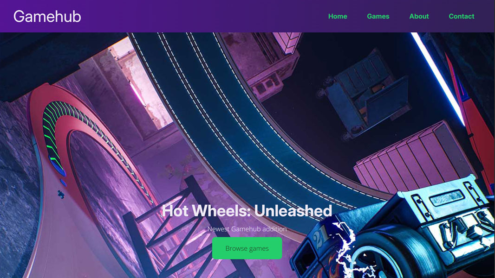

Noroff's "HTML and CSS". The idea is create a Figma design in code, using only HTML and CSS. In the prior "Design" course we were tasked to pick 'clothes', 'movies' or 'games' as a topic. In our chosen topic, we designed our site in Figma and this is the code version of that design.

   (optinoal)

- [Brief](https://noroff.sharepoint.com/:b:/s/FED1OSL24/EXvJ9TMGmU9Fsok1mQq1H08BKzQaheKEX5-p2e9czBsIdQ?e=TDbpCH)
- [Site](https://courageous-hamster-66684d.netlify.app/)
